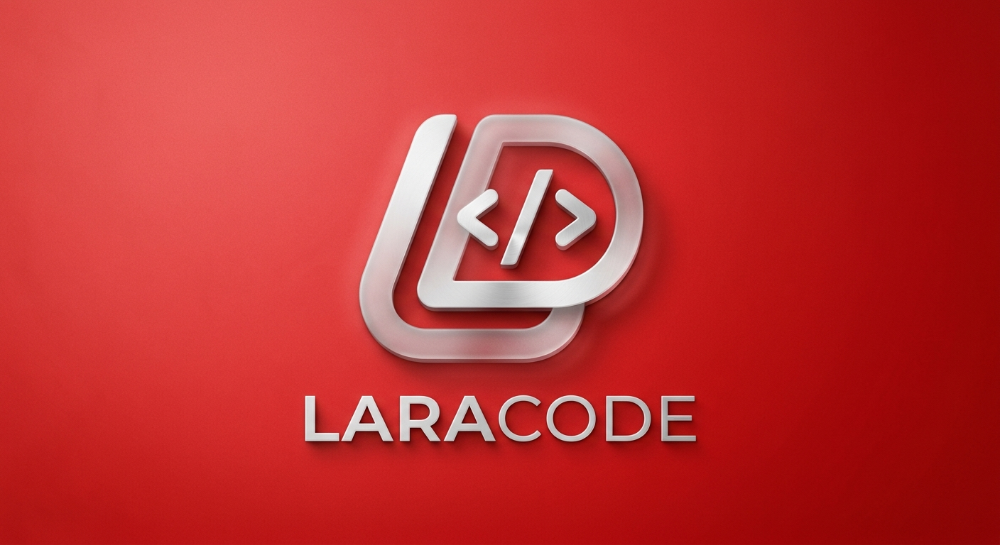

# Laracode

# 🚀 Laracode
**Your Lightweight, Native IDE for PHP & Laravel Development**

[English](#english) | [فارسی](#فارسی)

---

---

## 🇺🇸 English

### 📝 About Laracode
Laracode is a minimalist, native IDE designed to supercharge your Laravel development workflow. Built for developers who value performance and simplicity, it strips away the bloat of traditional IDEs while providing all the essential tools you need.

### ✨ Key Features
*   **Integrated Workflow**: A clean environment to manage your Laravel lifecycle from scratch.
*   **Native Terminal**: Run `artisan`, `composer`, or shell commands directly within the IDE.
*   **Intuitive File Explorer**: Organize and edit your project files with ease.
*   **Server Management**: Start and stop your local development server with a single click.
*   **One Dark Pro Inspired**: A professionally crafted dark theme to enhance focus and reduce eye strain.
*   **High Performance**: Lightweight and optimized for fast startup and low memory usage.

### 🚀 Getting Started
1. **Download**: Grab the latest release from our [Releases page](../../releases).
2. **Run**: Simply execute the file (no complex setup required).
3. **Enjoy**: Open your project root and start building!

---

## 🇮🇷 فارسی

### 📝 درباره لاراکد
لاراکد (Laracode) یک IDE بومی و مینیمال است که با هدف افزایش سرعت و بهره‌وری در توسعه پروژه‌های لاراول طراحی شده است. ما معتقدیم توسعه‌دهنده باید بر روی کدنویسی تمرکز کند، نه درگیر شدن با تنظیمات پیچیده و سنگینِ محیط‌های توسعه.

### ✨ ویژگی‌های کلیدی
*   **گردش کار یکپارچه**: ابزاری جامع برای مدیریت صفر تا صد پروژه‌های لاراول.
*   **ترمینال بومی**: اجرای دستورات `artisan` و `composer` در محیطی یکپارچه.
*   **فایل اکسپلورر حرفه‌ای**: مدیریت ساختار پروژه با دسترسی سریع و آسان.
*   **مدیریت سرور**: راه‌اندازی سرور لوکال با یک کلیک.
*   **تم One Dark Pro**: طراحی چشم‌نواز و استاندارد برای محیط‌های برنامه‌نویسی.
*   **سبک و پرسرعت**: بهینه‌سازی شده برای اجرا روی سخت‌افزارهای مختلف بدون اشغال منابع سیستم.

### 🚀 راهنمای شروع
۱. **دانلود**: آخرین نسخه را از بخش [Releases](../../releases) دریافت کنید.
۲. **اجرا**: بدون نیاز به نصب یا تنظیمات خاص، فایل اجرایی را باز کنید.
۳. **کدنویسی**: پوشه پروژه خود را انتخاب کرده و توسعه را شروع کنید!

---

## 🛠 Tech Stack
*   **Core**: Python
*   **GUI**: TTKBootstrap
*   **Design**: Minimalist

## 🤝 Contribution
Laracode is an open-source project. If you have ideas, feedback, or want to report a bug, please feel free to open an issue or submit a pull request.

## 📄 License
This project is licensed under the MIT License. See the [LICENSE](LICENSE) file for more information.

---

Made with ❤️ by Armin Daraei

