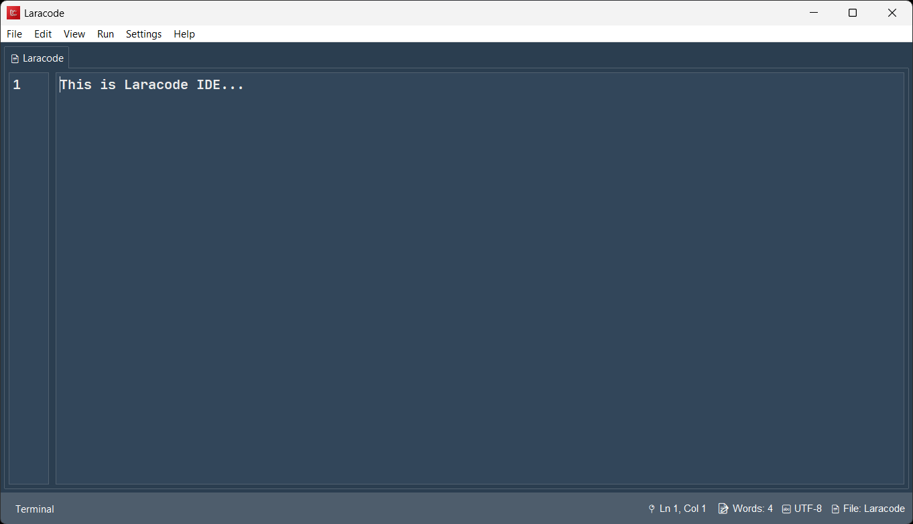

# Laracode

# 🚀 Laracode
**Your Lightweight, Native IDE for PHP & Laravel Development**

---

[English](#english) | [فارسی](#فارسی)

 

---

## 🇺🇸 English

### 📝 About Laracode
Laracode is not just another text editor; it is a specialized, native IDE designed to streamline the Laravel development lifecycle. While massive IDEs consume gigabytes of RAM and take forever to load, Laracode focuses on **speed, minimalism, and focus**. Whether you are scaffolding a new project, running artisan commands, or managing your local server, Laracode puts the tools you need right at your fingertips without the bloat.

### ⚠️ Critical Prerequisites
**Laracode relies on your local environment to perform Laravel tasks.** Before using the IDE, ensure your system meets the following requirements:
*   **PHP Installed**: Laracode executes PHP scripts to manage your projects.
*   **Composer Installed**: Required to install dependencies, update packages, and generate project scaffolding.
*   **System PATH**: Ensure `php` and `composer` are added to your System Environment Variables so Laracode can invoke them.

### ✨ Core Features
*   **Unified Workflow**: A seamless environment for project creation, file management, and server execution.
*   **Embedded Terminal**: A native, fast terminal that keeps your focus inside the IDE while running `php artisan` commands or `composer` scripts.
*   **Smart File Explorer**: Tree-view file navigation with intuitive management, specifically optimized for Laravel's directory structure.
*   **One-Click Server**: Built-in server management to spin up your local development environment instantly.
*   **One Dark Pro Aesthetic**: A professionally crafted, dark-themed interface designed to reduce eye strain and enhance coding productivity.
*   **Native Performance**: Written with performance in mind, ensuring a lag-free experience on any Windows machine.

---

## 🇮🇷 فارسی

### 📝 درباره لاراکد
لاراکد (Laracode) فراتر از یک ویرایشگر متن ساده است؛ این یک محیط توسعه (IDE) اختصاصی و بومی است که با هدف بهینه‌سازی چرخه توسعه پروژه‌های لاراول ساخته شده است. برخلاف IDEهای سنگین که منابع سیستم شما را به شدت اشغال می‌کنند، لاراکد بر روی **سرعت، سادگی و تمرکز** بنا شده است. لاراکد تمامی ابزارهای مورد نیاز شما را در یک محیط یکپارچه ارائه می‌دهد تا بدون درگیر شدن با پیچیدگی‌های ابزارهای حجیم، بر روی کدنویسی خود تمرکز کنید.

### ⚠️ پیش‌نیازهای حیاتی (حتماً مطالعه کنید)
**لاراکد برای انجام وظایف خود به محیط سیستم‌عامل شما وابسته است.** قبل از استفاده از نرم‌افزار، حتماً موارد زیر را روی سیستم خود نصب کرده باشید:
*   **نصب بودن PHP**: لاراکد برای اجرای اسکریپت‌ها و مدیریت پروژه، به PHP نیاز دارد.
*   **نصب بودن Composer**: برای مدیریت وابستگی‌ها، نصب پکیج‌ها و ایجاد پروژه (Scaffolding)، نصب بودن کامپوزر الزامی است.
*   **تنظیمات PATH**: اطمینان حاصل کنید که دستورات `php` و `composer` در محیط ویندوز شما (Environment Variables) به درستی ست شده باشند تا لاراکد بتواند آن‌ها را فراخوانی کند.

### ✨ ویژگی‌های کلیدی
*   **گردش کار یکپارچه**: محیطی منسجم برای ایجاد پروژه، مدیریت فایل‌ها و اجرای سرور بدون نیاز به خروج از برنامه.
*   **ترمینال هوشمند داخلی**: استفاده از ترمینال بومی و سریع برای اجرای دستورات `php artisan` و اسکریپت‌های `composer` درست در دل محیط توسعه.
*   **فایل اکسپلورر بهینه**: مدیریت درختی فایل‌ها با دسترسی سریع، طراحی شده مخصوص ساختار پوشه‌بندی لاراول.
*   **راه‌اندازی سرور با یک کلیک**: مدیریت و اجرای سرور لوکال توسعه تنها با یک کلیک ساده.
*   **تم حرفه‌ای One Dark Pro**: طراحی چشم‌نواز با الهام از تم محبوب دنیای برنامه نویسی جهت افزایش تمرکز و کاهش خستگی چشم.
*   **عملکرد بومی (Native)**: بهینه‌شده برای ویندوز، جهت تضمین تجربه‌ای سریع، بدون لگ و با مصرف منابع حداقلی.

---

## 🚀 Getting Started | راهنمای شروع
1.  **Preparation**: Ensure PHP and Composer are configured on your system.
2.  **Download**: Get the latest version from the [Releases page](../../releases).
3.  **Run**: Launch the executable. No complex installation is needed.
4.  **Create/Open**: Use the File menu to open an existing project or create a new one!

---
*Developed with ❤️ by Armin*
